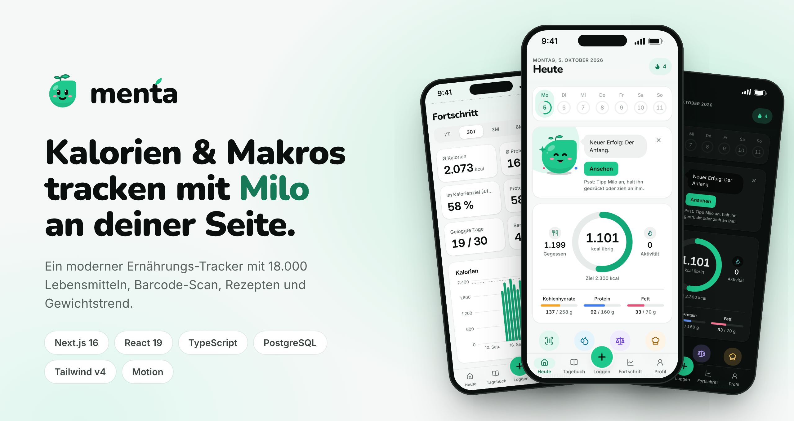
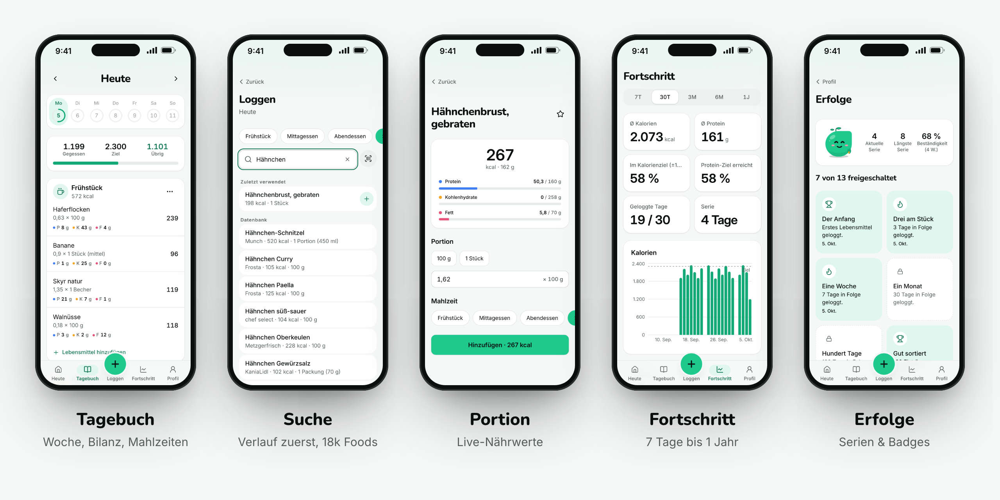
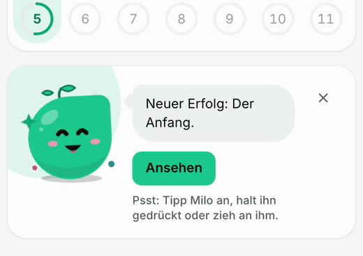
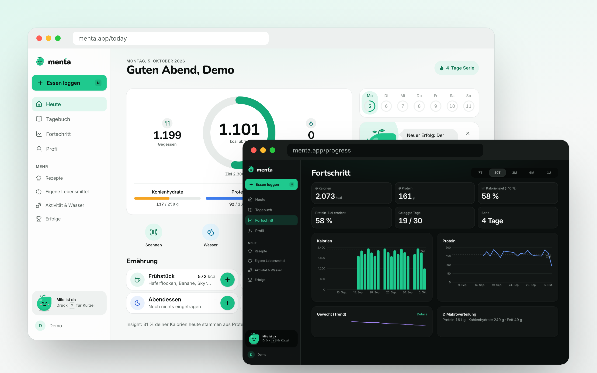
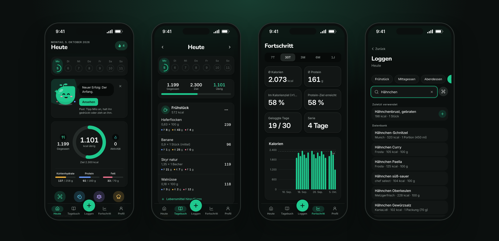

<div align="center">

<picture>
  <source media="(prefers-color-scheme: dark)" srcset="public/brand/menta-lockup-dark.svg">
  
</picture>

### Klarheit auf dem Teller.

Ein moderner Kalorien- und Makro-Tracker mit Maskottchen **Milo** als Coach.


[](https://github.com/Jonas480185/menta/actions/workflows/ci.yml)


</div>

<br>



## Überblick

Menta macht das Tracken von Ernährung so schnell und angenehm wie möglich: Lebensmittel in zwei Taps loggen,
Kalorien und Makros auf einen Blick sehen und den Gewichtstrend statt täglicher Schwankungen verfolgen.
Die App ist mobile-first gebaut, funktioniert aber genauso gut am Desktop, mit Tastenkürzeln und mehrspaltigen
Layouts. UI-Sprache ist Deutsch, Light und Dark Mode werden vollständig unterstützt.

**Highlights**

- 🔎 **Schnelle Suche** über ~18.000 lokale Lebensmittel plus Live-Fallback auf Open Food Facts, Verlauf und Favoriten zuerst
- 📷 **Barcode-Scan** per Kamera mit Anlage-Flow für unbekannte Produkte
- 🎯 **Transparente Zielberechnung** (Mifflin-St Jeor, PAL, Tempo) mit Makro-Modi und Tagesprofilen
- 📈 **Fortschritt** von 7 Tagen bis 1 Jahr, geglätteter Gewichtstrend, Serien und Erfolge
- 🌱 **Milo**, ein interaktiver Coach, der kontextabhängig hilft (und sich streicheln lässt)
- ⌨️ **Desktop-optimiert** mit Seitenleiste, Tastenkürzeln (`N`, `/`, `⌘K`, `1` bis `4`, `?`) und Zwei-Spalten-Layouts

## Screens



### Milo, der Coach

<table>
<tr>
<td width="52%"></td>
<td>

Milo gibt kontextabhängige Hinweise, etwa wenn das Frühstück fehlt, das Protein-Ziel erreicht ist oder
die Serie in Gefahr ist. Dahinter stehen 15 priorisierte Regeln, formuliert ohne erhobenen Zeigefinger.

Und er ist interaktiv:

- **Tippen:** hüpfen, wackeln, drehen, kichern
- **Doppeltippen:** Salto mit Konfetti
- **Gedrückt halten:** aufladen und Power-Up
- **Ziehen:** fliegt mit und federt zurück
- **Streicheln** mit der Maus: Herzaugen
- Augen folgen dem Zeiger, Blinzeln, Idle-Animationen

Respektiert `prefers-reduced-motion` und ist per Tastatur bedienbar.

</td>
</tr>
</table>

### Desktop



### Dark Mode



## Funktionen

| Bereich | Umfang |
|---|---|
| **Konto & Onboarding** | Registrierung/Login (better-auth), 8-stufiges Onboarding mit nachvollziehbarer Kalorien- und Makroberechnung |
| **Loggen** | Suche mit Verlauf-Ranking, Schnellauswahl (Zuletzt / Häufig / Favoriten mit letzter Portion), Barcode, Portionen, Mahlzeit oder Tag kopieren, Rückgängig |
| **Lebensmittel & Rezepte** | Eigene Lebensmittel mit Validierung, Rezepte mit Live-Nährwerten pro Portion, loggbar wie jedes Lebensmittel |
| **Ziele** | Berechnet oder manuell, Makro-Modi Prozent / Gramm / Empfehlung, Tagesprofile (Training, Ruhetag, Refeed …) pro Wochentag |
| **Körper & Aktivität** | Gewicht mit geglättetem 7-Tage-Trend und Zielprognose, Aktivitäten (MET-basiert), Wasser |
| **Auswertung** | Kalorien, Protein, Zielerreichung und Beständigkeit über 7T / 30T / 3M / 6M / 1J |
| **Motivation** | Serien, 13 Erfolge, Milo-Coach mit kontextabhängigen Hinweisen |

## Tech-Stack

| | |
|---|---|
| **Framework** | Next.js 16 (App Router, React 19, Server Components, Server Actions, Turbopack) |
| **Sprache** | TypeScript (strict), Zod für jede externe Eingabe |
| **Daten** | PostgreSQL mit Drizzle ORM · lokal **PGlite** (PostgreSQL 17 als WASM, kein DB-Server nötig) |
| **Auth** | better-auth (E-Mail + Passwort) |
| **UI** | Tailwind CSS v4 (CSS-first Design Tokens), Radix-Primitives, motion, Recharts, lucide |
| **Tests** | Vitest + Testing Library (Unit & DB-Integration), Playwright (E2E) |

## Architektur

```
src/
  domain/            Reine Fachlogik ohne Framework-Abhängigkeiten, vollständig unit-getestet
                     (Nährwert-Mathe, Kalorien- & Makro-Engine, Gewichtstrend, Aktivität, Engagement)
  server/
    db/              Drizzle-Schema, Migrationen, Such-SQL
    food/            Provider-Abstraktion (Open Food Facts, USDA, lokal), Normalisierung, Import-Pipeline
    services/        Use-Cases als fn(ctx, input), immer auf ctx.userId gescoped, gegen echte DB getestet
  app/               Routen: Server Components lesen über Services, Mutationen über Server Actions
  components/        UI-Bibliothek (ui/) und Feature-Komponenten
```

**Technische Entscheidungen, die sich lohnen anzusehen**

- **Nährwert-Snapshots im Tagebuch:** Einträge speichern ihre Nährwerte zum Logzeitpunkt. Aktualisierte oder
  bearbeitete Lebensmittel verändern die Historie nie still; Tagessummen werden live per SQL aggregiert, es gibt
  keine redundante Summentabelle, die invalidiert werden müsste.
- **Eingefrorene Tagesziele:** `daily_nutrition` hält die Ziele vergangener Tage fest, sodass Zieländerungen
  alte Auswertungen nicht verfälschen.
- **Hybride Lebensmitteldaten:** Open Food Facts (Markenprodukte, Barcodes), USDA FoodData Central (generische
  Lebensmittel, Mikronährstoffe) und 446 kuratierte deutsche Grundnahrungsmittel; normalisiert, validiert,
  dedupliziert und mit Positiv-/Negativ-Cache.
- **Suche:** generierte `tsvector`-Spalte, Trigram-GIN- und Präfix-Index, zweistufige Abfrage: bei 1 Mio.
  Lebensmitteln meist 3 bis 60 ms. Ranking: Verlauf → exakte Treffer → Favoriten → eigene → Datenbank.
- **Datenintegrität:** 39 CHECK-Constraints sichern plausible Werte direkt in der Datenbank.
- **Barrierefreiheit:** semantische Design-Tokens, Kontraste nach WCAG AA, sichtbarer Fokus, Touch-Ziele ≥ 44 px,
  `prefers-reduced-motion` überall respektiert.

Ausführliche Dokumentation: [`docs/ARCHITECTURE.md`](docs/ARCHITECTURE.md) ·
[Datenbank](docs/architecture/database.md) · [Lebensmitteldaten](docs/architecture/food-data-strategy.md) ·
[Kalorien-Engine](docs/architecture/calorie-engine.md) · [Makro-Engine](docs/architecture/macro-engine.md) ·
[Design-System](docs/design/design-system.md) · [Marke](docs/brand/identity.md)

## Qualität

- **1.275 Tests** in 72 Dateien: Fachlogik, Services gegen frische In-Memory-PostgreSQL-Instanzen,
  Komponenten und ein E2E-Flow (Registrierung → Onboarding → Suche → Loggen → Portion ändern)
- **CI** auf jedem Push: Typecheck, Lint, Tests und Production-Build (GitHub Actions)

## Sicherheit

- Server Actions und Route Handler prüfen die Session serverseitig; alle Abfragen sind auf den angemeldeten
  Nutzer beschränkt, Eigentümerschaft wird vor jeder Änderung geprüft
- Zod-Validierung aller Eingaben, parametrisierte SQL-Abfragen, sichere `?next=`-Weiterleitungen
- **Content Security Policy** mit Nonce pro Request (`strict-dynamic`, `frame-ancestors 'none'`) plus HSTS,
  `X-Content-Type-Options`, `Referrer-Policy` und `Permissions-Policy`
- better-auth mit gehashten Passwörtern, HttpOnly-Cookies und Rate-Limiting; Konto-Löschung nur mit Passwort

Sicherheitslücken bitte vertraulich melden, siehe [SECURITY.md](SECURITY.md).

## Lokal starten

Voraussetzungen: Node.js ≥ 20 und pnpm.

```bash
pnpm install
cp .env.example .env     # die Defaults funktionieren lokal ohne Änderungen
pnpm db:seed             # Migrationen, ~18.000 Lebensmittel und ein Demo-Account (≈ 6 s)
pnpm dev                 # http://localhost:3000
```

Demo-Login: **demo@menta.app** / **menta-demo-2026** mit drei Wochen Beispiel-Tagebuch inklusive Gewicht und Wasser.

Es wird kein PostgreSQL-Server benötigt: lokal läuft PGlite mit Daten in `.data/pglite`.
Für Produktion `DATABASE_URL` auf eine PostgreSQL-Instanz (≥ 14, Extensions `pg_trgm` und `unaccent`) setzen.

| Befehl | Zweck |
|---|---|
| `pnpm dev` · `pnpm build && pnpm start` | Entwicklung · Produktion |
| `pnpm check` | Typecheck, Lint, Tests und Build |
| `pnpm test:e2e` | Playwright-E2E gegen einen laufenden Server |
| `pnpm db:migrate` · `pnpm db:seed` · `pnpm db:reset` | Datenbank |

<details>
<summary><b>Umgebungsvariablen</b></summary>

| Variable | Default | Beschreibung |
|---|---|---|
| `DATABASE_URL` | leer | `postgres://…` für echtes PostgreSQL, leer = PGlite |
| `PGLITE_DATA_DIR` | `./.data/pglite` | Datenverzeichnis für PGlite |
| `BETTER_AUTH_SECRET` | Dev-Fallback | **In Produktion Pflicht**, ≥ 32 Zeichen (`openssl rand -base64 32`) |
| `BETTER_AUTH_URL` | leer | Öffentliche URL der App |
| `USDA_API_KEY` | `DEMO_KEY` | USDA FoodData Central |
| `OFF_USER_AGENT` | App-Name | User-Agent für Open Food Facts |
| `FOOD_EXTERNAL_PROVIDERS_ENABLED` | `true` | `false` = Offline-Modus, nur lokale Datenbank |

</details>

## Datenquellen & Lizenzen

- Lebensmitteldaten von [Open Food Facts](https://world.openfoodfacts.org) (ODbL), Attribution in der App sichtbar
- [USDA FoodData Central](https://fdc.nal.usda.gov) (Public Domain / CC0)
- Wortmarke auf Basis von [Nunito](https://fonts.google.com/specimen/Nunito) (SIL Open Font License)

## Ausblick

Passwort-Reset und E-Mail-Verifizierung · Anbindung von Wearables (die Provider-Schnittstelle ist vorbereitet) ·
Barcode-Scan per Kamera ist auf Browser mit `BarcodeDetector` angewiesen, sonst manuelle Eingabe.

---

<div align="center">
Entwickelt von <a href="https://github.com/Jonas480185">Jonas Lunkwitz</a>
</div>
