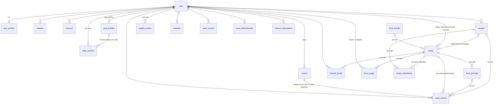

# Database Architecture

Owner: Database. Source of truth: `src/server/db/schema/*.ts` (every table is commented)
and the migrations in `drizzle/`. This document explains **why** the schema looks the way it does,
which query each index serves, the reference food search SQL, and how the team works with migrations.

Contents: 1 ER diagram · 2 Tables · 3 Snapshot vs. computed · 4 Units & conventions · 5 Integrity rules
· 6 Food search · 7 Benchmark · 8 Index catalogue · 9 Migration workflow · 10 Production & backups
· 11 Test harness & seeding

---

## 1. ER diagram



`external_lookup_cache` is standalone (keyed by provider + query/barcode).

## 2. Tables: rationale

| Spec entity | Table | Key decisions |
|---|---|---|
| User | `user`, `session`, `account`, `verification` | better-auth shape, text ids. Everything user-owned cascades from `user.id`. |
| UserProfile | `user_profiles` (PK = user_id) | 1:1, body data + preferences. Current weight is **not** stored here: it's the latest `weight_entries` row. |
| NutritionGoal | `goal_profiles` | Day profiles (`kind`: default/training/rest/high_carb/low_carb/refeed/custom). `weekdays smallint[]` (ISO 1-7) schedules a profile automatically. Exactly one active default per user (partial unique index). Archive via `archived_at` instead of deleting. |
| DailyNutrition | `daily_nutrition` (PK user_id+date) | Per-date **target snapshot** + optional per-date override (`goal_profile_id`, `profile_overridden`). No consumed totals (see §3). |
| Food / FoodNutrients | `foods` | One table for every food: database foods (`usda`/`off`/`curated`, `owner_user_id` null), user foods (`source='user'`) and recipe foods (`source='recipe'`). Nutrients are columns per 100 g/ml + `micronutrients jsonb` for the long tail. |
| FoodBrand | `food_brands` + denormalized `foods.brand_name/brand_normalized` | Brand rows for dedup/filters; the denormalized copy keeps search a single-table query. |
| FoodServing | `food_servings` | `grams` = base units (g or ml) of one serving. Every food has a 100 g/ml serving. |
| UserFood | `foods` with `source='user'`, `visibility='private'`, owner | Same code paths as any food (search, favorites, logging). |
| Recipe / RecipeIngredient | `recipes`, `recipe_ingredients` | Each recipe owns a private `foods` row (`recipes.food_id`, unique) so a recipe is searchable/loggable like a food. |
| Meal | `meals` | User-configurable slots; archived, not deleted. |
| MealEntry | `meal_entries` | Nutrient **snapshot** at log time (see §3). `food_id`/`serving_id`/`recipe_id` are soft links (set null). |
| FavoriteFood | `favorite_foods` (PK user+food) | |
| RecentFood | `food_usage` (PK user+food) | Recent (`last_used_at`), frequent (`use_count`) and the last portion/meal for one-tap re-logging. Upserted on every log. |
| WeightEntry | `weight_entries` | Unique per user+date. |
| Activity | `activities` | `source` + `external_id` (unique per user) for idempotent wearable sync. |
| WaterEntry | `water_entries` | Many per day, summed on read. |
| – | `user_achievements`, `mascot_interactions`, `external_lookup_cache` | Gamification, Milo message history, provider cache (§7 ARCHITECTURE). |

## 3. Snapshot vs. computed

| Data | Decision | Why |
|---|---|---|
| Entry nutrients (`meal_entries.kcal…`) | **Snapshot** at log time, recomputed only when the entry itself changes | Provider foods get refreshed and user foods edited: a past diary must never silently change. Also makes day totals a single-table `SUM`. |
| Entry display data (`food_name`, `brand_name`, `serving_label`, `serving_grams`) | **Snapshot** | The entry stays readable after the food is deleted (FK → set null). |
| Daily consumed totals | **Computed** on read: `SUM(...) FROM meal_entries WHERE user_id=? AND date=?` (index `meal_entries_user_date_idx`) | Nothing to invalidate; < 5 ms even for heavy users. Ranges (analytics) use the same index with `date BETWEEN`. |
| Daily targets | **Frozen** in `daily_nutrition` | Changing goals must not rewrite past adherence. Today/future rows are refreshed from the resolved profile, past rows are kept. If the referenced profile is deleted, `goal_profile_id` becomes null and the frozen targets stay. |
| Recipe nutrients per 100 g | **Stored** on the recipe's `foods` row, recomputed by the Recipes service on ingredient change | Search/logging treat recipes like foods. |
| Streaks, trends, current weight | **Computed** | Cheap with the `(user_id, date)` indexes. |
| Popularity (`foods.popularity`) | **Stored** counter (upstream scans + our log counts) | Needed inside the search index path. |

## 4. Units & conventions

- Energy **kcal**, macros **g**, minerals **mg**; food nutrients are **per 100 g** (`nutrient_basis='g'`) or
  **per 100 ml** (`'ml'`, optional `density_g_per_ml`). `food_servings.grams` / `meal_entries.grams` are base units (g or ml).
- Dates are calendar days `date` (`'YYYY-MM-DD'`, mode string) in the user's timezone; instants are `timestamptz`.
- Floats are `double precision`; round only for display.
- `*_normalized` columns are written by the app via `normalizeFoodText()` (lowercase, diacritics folded, ß→ss,
  punctuation collapsed). `unaccent()` is not IMMUTABLE, so it can't be used in generated columns or index
  expressions: the app-side normalization is the single source of truth and is applied to both data and queries.
- Drizzle `casing: "snake_case"`: TS `proteinG` ↔ column `protein_g`.

## 5. Integrity rules

### Delete behaviour

| Deleting … | Effect |
|---|---|
| a user | Everything user-owned cascades (profile, goals, daily rows, meals, entries, own foods + recipes, favorites, usage, weight, water, activities, achievements, mascot log, sessions). Public foods are untouched. |
| a meal slot with entries | **Rejected** (23503). Slots are archived (`is_archived`). |
| a food | `meal_entries.food_id/serving_id` → null (snapshot kept); favorites, usage, servings cascade; `recipes.food_id` → null. **Rejected** if the food is an ingredient of any recipe: archive it (`is_archived`) instead. |
| a serving | Entries/ingredients/usage keep working (`serving_id` → null, label + grams are snapshotted). |
| a goal profile | `daily_nutrition.goal_profile_id` → null, frozen targets remain. Prefer archiving. |

The two "rejected" FKs (`recipe_ingredients.food_id`, `meal_entries (meal_id, user_id)`) are
`NO ACTION DEFERRABLE INITIALLY DEFERRED` (custom migration `0002_deferred_fks.sql`). Reason: Postgres checks
RI constraints fired inside a cascade at the end of each cascaded sub-statement, so with an immediate
RESTRICT the user delete failed depending on trigger order. Deferred, the check runs at COMMIT when the cascade
is complete. Consequence for services: inside an explicit transaction the violation surfaces at **commit**, not
at the `DELETE`: check usage first (e.g. "is this food used in a recipe?") and show a friendly message.

`meal_entries (meal_id, user_id) → meals (id, user_id)` is a composite FK: an entry can only reference a meal
slot of the **same user** (defence in depth on top of `ctx.userId` scoping).

### CHECK constraints (decisions)

| Rule | Constraint |
|---|---|
| Food nutrients ≥ 0 (kcal, macros, fiber, sugar, sat. fat, salt, minerals) | `foods_nutrients_non_negative` |
| Plausibility per 100 g: each macro ≤ 100 g, P+C+F ≤ 105 g (5 g rounding tolerance), kcal ≤ 1000. Per 100 ml the limits double (dense liquids: honey ≈ 115 g sugar/100 ml). | `foods_nutrients_plausible` |
| Stricter checks (kcal vs. 4/4/9, sugar ≤ carbs, …) are **not** constraints, providers disagree on definitions (US carbs include fiber). The importer sets `data_quality`/`quality_flags` instead. |, |
| User/recipe foods have an owner, database foods never do; private foods need an owner | `foods_owner_matches_source`, `foods_private_has_owner` |
| Names not blank | `foods_name_not_blank`, `recipes_name_not_blank`, `goal_profiles_name_not_blank`, `meal_entries_food_name_not_blank`, `activities_name_not_blank` |
| Serving `grams > 0`, `amount > 0` | `food_servings_*` |
| Entry `quantity > 0`, `grams ≥ 0`, `serving_grams ≥ 0` (0 allowed for quick-add calories), nutrients ≥ 0 | `meal_entries_*` |
| Weight 20-400 kg, body fat 0-100 % | `weight_entries_*`, `user_profiles_weight_range` |
| Height 50-300 cm | `user_profiles_height_range` |
| Water `amount_ml > 0` | `water_entries_amount_positive` |
| Goal `calorie_target > 0`; macro grams ≥ 0 (a zero-carb profile is legitimate); percents 0-100; optional targets > 0; weekdays ⊆ {1..7}; an archived profile can't be default | `goal_profiles_*` |
| Daily targets: kcal > 0, macros ≥ 0 | `daily_nutrition_*` |
| Recipe servings > 0, total weight > 0; ingredient quantity/grams > 0 | `recipes_*`, `recipe_ingredients_*` |
| Activity values ≥ 0 | `activities_values_non_negative` |
| `meals.default_time` is `HH:MM` | `meals_default_time_format` |

Uniqueness: one active default goal profile per user (`goal_profiles_one_default_per_user`, partial:
`is_default AND archived_at IS NULL`: switch defaults by demoting then promoting inside one transaction);
one weight entry per day; `foods (source, source_id)` for idempotent imports; `recipes.food_id`; activity
`(user_id, source, external_id)`. Not enforced in SQL: overlapping weekdays between two profiles (needs
`btree_gist`; the Goals service validates it).

## 6. Food search (reference SQL)

Implementation: `src/server/db/food-search-sql.ts`, `buildFoodSearchSql()`, `searchFoodsReference(db, input)`,
`normalizeSearchQuery()`, tunable `DEFAULT_FOOD_SEARCH_WEIGHTS` and `DEFAULT_CANDIDATE_CAPS`.
Tests: `src/server/db/search.test.ts`. **Food Search** builds the search service/ranking on top of it (add recents,
favorites, provider fallback): keep the WHERE clauses index-shaped.

### Search columns

- `name_normalized`, `brand_normalized`: app-normalized text (§4).
- `search_vector tsvector GENERATED ALWAYS AS (...) STORED`: weighted document:
  `A` = name_normalized, `B` = brand_normalized, `C` = category (folded inline with
  `lower/replace/translate`, which are IMMUTABLE). Config `simple`: no stemming/stop words (mixed DE/EN data,
  prefix search instead of stemming). Never written by the app (`$inferInsert` excludes it).

### Access paths (all partial on `visibility = 'public' AND NOT is_archived`)

| Query shape | Index |
|---|---|
| `name_normalized = q`, `name_normalized LIKE 'q%'` | `foods_name_prefix_idx` (btree `text_pattern_ops`: works under any collation) |
| word-prefix full text `search_vector @@ to_tsquery('simple','hafer:* & flo:*')` | `foods_search_vector_idx` (GIN) |
| typo / compound words `q <% name_normalized` (word_similarity ≥ 0.6), also `%`, `LIKE '%x%'` | `foods_name_trgm_idx` (GIN `gin_trgm_ops`) |
| fuzzy brand `q <% brand_normalized` | `foods_brand_trgm_idx` |
| top-N by popularity | `foods_popularity_idx` (ASC btree, scanned backwards: see note) |
| the user's own foods + recipes | `foods_owner_idx (owner_user_id, name_normalized) WHERE owner_user_id IS NOT NULL` |

**The public-foods predicate must be literal SQL** (`visibility = 'public' AND NOT is_archived`, exported as
`PUBLIC_FOODS_PREDICATE` from the schema): with bound parameters the planner can't prove the partial-index
predicate. Why partial: at scale, private user foods can outnumber public ones; they must not bloat the
public search indexes or produce thousands of heap rechecks for other users' rows.

Note on `DESC` indexes: drizzle's `.desc()` emits `DESC NULLS LAST`, which does **not** match
`ORDER BY x DESC` (= NULLS FIRST), so the planner can't use it for ordering. Keep ordering indexes ASC.

### Query normalization

`normalizeSearchQuery(query)` → `q = normalizeFoodText(query)`; tsquery = every token as prefix, AND-ed
(`"joghurt erdbeere"` → `joghurt:* & erdbeere:*`). Only letters, digits and `%.,` survive normalization,
so no tsquery syntax can be injected; `to_tsquery` re-tokenizes `1,5`/`3.5` exactly like `to_tsvector`
did. `q` shorter than 3 characters uses the short path (trigrams need ≥ 3 chars).

### Reference query (≥ 3 characters): two stages

```sql
-- $q = normalizeFoodText(input), $tsq = 'tok1:* & tok2:*', $prefix = escape_like($q) || '%', $user
WITH fts AS MATERIALIZED (
  SELECT f.id FROM foods f
  WHERE f.visibility = 'public' AND NOT f.is_archived AND f.search_vector @@ to_tsquery('simple', $tsq)
  ORDER BY f.popularity DESC LIMIT 300
),
candidates AS (                                             -- stage 1: bounded, index-driven
  (SELECT f.id FROM foods f WHERE <public> AND f.name_normalized = $q
     ORDER BY f.popularity DESC LIMIT 50)                                   -- exact
  UNION (SELECT f.id FROM foods f WHERE <public> AND f.name_normalized LIKE $prefix
     ORDER BY f.popularity DESC LIMIT 100)                                  -- starts with
  UNION (SELECT id FROM fts)                                                -- full text
  UNION (SELECT f.id FROM foods f WHERE <public> AND $q <% f.name_normalized
     AND (SELECT count(*) FROM fts) < 300                                   -- typo fallback only
     ORDER BY f.popularity + 0 DESC LIMIT 300)                              -- "+0": force GIN bitmap
  UNION (SELECT f.id FROM foods f WHERE <public> AND $q <% f.brand_normalized
     ORDER BY f.popularity + 0 DESC LIMIT 100)                              -- brand
  UNION (SELECT f.id FROM foods f WHERE f.owner_user_id = $user AND NOT f.is_archived
     AND (f.search_vector @@ to_tsquery('simple', $tsq) OR $q <% f.name_normalized
          OR f.name_normalized LIKE $prefix))                               -- own foods, uncapped
)
SELECT f.*,                                                  -- stage 2: score ≤ ~850 rows
    3.0 * (f.name_normalized = $q)::int
  + 1.5 * (f.name_normalized LIKE $prefix)::int
  + 1.0 * word_similarity($q, f.name_normalized)
  + 0.5 * similarity($q, f.name_normalized)                  -- prefers short names ("Milch" over "Milchreis Vanille")
  + 0.3 * coalesce(word_similarity($q, f.brand_normalized), 0)
  + 1.0 * coalesce(ts_rank_cd(f.search_vector, to_tsquery('simple', $tsq), 32), 0)   -- ∈ [0,1)
  + 0.4 * least(ln(1 + f.popularity) / ln(1 + 1e6), 1)
  + CASE f.data_quality WHEN 'verified' THEN 0.1 WHEN 'suspect' THEN -0.3 ELSE 0 END
  + 0.5 * (f.owner_user_id IS NOT DISTINCT FROM $user)::int  -- own foods/recipes
  AS score
FROM candidates c JOIN foods f ON f.id = c.id
ORDER BY score DESC, f.name
LIMIT 25;
```

Design notes (all measured, see §7):

- **Why two stages:** scoring (`word_similarity`, `ts_rank_cd`) is the expensive part. A single-stage
  `WHERE fts OR trigram ORDER BY score` scored every match: 709 ms for `milch` at 200k rows (~20 % of rows
  match). Bounded candidates make the worst case independent of table size.
- **"Most popular among matches"** per branch lets the planner choose: for a common token it walks
  `foods_popularity_idx` backwards and stops after `cap` hits; for a rare token it bitmap-scans the GIN index
  and sorts a handful of rows. Their row estimates (tsvector stats, btree) are accurate.
- **Trigram is different:** `<%` costs ~2.5 µs/row and the planner underestimates that, so an
  ordered/unordered `LIMIT` made it walk the popularity index or seq-scan (50-600 ms on misestimates).
  `ORDER BY popularity + 0` (not indexable) forces the GIN bitmap. And the name-trigram branch only runs when
  FTS found fewer than its cap (typos, compound words in small result sets); the uncorrelated sub-select
  becomes a one-time filter, so the branch is skipped entirely otherwise.
- **Trade-off:** for a very common token, compound matches not starting with it ("Hafer*milch*" for `milch`)
  only appear if they're among the 300 most popular FTS hits. Typing more ("hafermilch") finds them directly.
- **Umlaut transliteration** (`ae/oe/ue` typed for `ä/ö/ü`) is not handled: `normalizeFoodText` folds `ä→a`,
  so "haehnchen" ≠ "hahnchen" (trigram similarity 0.6: borderline). Suggestion for Food Search: when the query
  contains `ae|oe|ue`, also search the variant with `a|o|u` (second `$q`) and merge.
- `pg_trgm.word_similarity_threshold` (default 0.6) and `similarity_threshold` (0.3) are server defaults; tune
  per transaction with `SET LOCAL` if needed.

### Short queries (1-2 characters)

```sql
SELECT … FROM foods f WHERE <public> AND f.name_normalized LIKE 'ha%'
ORDER BY f.popularity DESC LIMIT 200   -- then ∪ own foods LIKE 'ha%', scored exact/prefix/popularity
```

### Other lookups

- Barcode: `SELECT … FROM foods WHERE barcode = $1` (`foods_barcode_idx`, partial `barcode IS NOT NULL`).
- Own foods list: `WHERE owner_user_id = $user AND NOT is_archived ORDER BY name_normalized` (`foods_owner_idx`).
- Recents: `food_usage WHERE user_id = $u ORDER BY last_used_at DESC LIMIT 20` (`food_usage_recent_idx`);
  frequent: `ORDER BY use_count DESC` (`food_usage_frequent_idx`); favorites: `favorite_foods_user_created_idx`.

## 7. Benchmark

`pnpm exec tsx scripts/db/bench-search.ts [--rows=200000] [--runs=20] [--verbose] [--only=<name>] [--random-page-cost=1.1]`

Creates an in-memory PGlite with all migrations, loads synthetic German-ish foods (84 product types with a
skewed distribution, modifiers/flavours, 430 brands, Zipf-like popularity, 2 % private user foods of 200 users,
1 % archived), runs `ANALYZE`, then each query with `EXPLAIN (ANALYZE, BUFFERS)` plus `--runs` timed executions
(after 2 warm-ups). It exits non-zero if an index-driven query falls back to a Seq Scan on `foods`.

**Environment:** PGlite 0.5.8 (Postgres 17, **WASM, single-threaded**) on an Apple-silicon Mac, in-memory,
while other builds/tests were running in parallel (load average ≈ 5.6, so absolute numbers are
pessimistic). Native Postgres (multi-threaded I/O, JIT-free but native code) was **not** available to measure;
expect it to be faster, but re-run the benchmark against a staging server before relying on that.

### 200 000 foods (53 MB table; search indexes: name trigram 13 MB, brand trigram 9.3 MB, FTS 6.4 MB, prefix 3.7 MB, popularity 1.8 MB), load 18 s

| Query | p50 ms | p95 ms | Indexes used |
|---|---:|---:|---|
| ref `haferflocken` (exact word) | 23.0 | 26.9 | popularity, name_trgm, brand_trgm, owner, pkey |
| ref `milch` (very common token, ~20 % of rows) | 5.9 | 7.1 | popularity, name_trgm (skipped at runtime), brand_trgm, owner, pkey |
| ref `joghurt erdbeere` (2 words) | 27.3 | 29.4 | search_vector, name_prefix, name_trgm, brand_trgm, owner, pkey |
| ref `hähnchenbr` (typing, umlaut) | 26.4 | 29.1 | popularity, name_prefix, name_trgm, brand_trgm, owner, pkey |
| ref `haferflokcen` (typo) | 31.6 | 34.6 | search_vector, name_prefix, name_trgm, brand_trgm, owner, pkey |
| ref `müller joghurt` (brand + product) | 15.9 | 17.6 | search_vector, name_prefix, name_trgm, brand_trgm, owner, pkey |
| ref `pastinake` (rare) | 12.1 | 14.5 | search_vector, name_prefix, name_trgm, brand_trgm, owner, pkey |
| ref `ha` (short → prefix path) | 6.0 | 7.6 | popularity, owner |
| exact name only | 0.3 | 0.4 | name_prefix |
| FTS only, `count(hafer:*)` (all matches) | 5.6 | 6.7 | search_vector |
| trigram only, `count('haferflokcen' <% name)` | 22.8 | 25.2 | name_trgm |
| brand trigram only | 2.3 | 3.3 | brand_trgm |
| barcode lookup | 0.1 | 0.2 | barcode |
| own foods list | 0.2 | 0.4 | owner |
| **baseline anti-pattern** `lower(name) LIKE '%haferflocken%'` | 78.0 | 85.2 | **Seq Scan** |

Evolution during design (200k rows, same machine): single-stage OR query, `milch` **709 ms** (seq scan +
scoring 40k rows) → two-stage with popularity-ordered branches: `milch` 9.6 ms but `haferflocken` 64 ms
(trigram branch walked the popularity index) → final design above.

### 1 000 000 foods

263 MB table; name trigram 42 MB, brand trigram 26 MB, FTS 16 MB, prefix 14 MB, popularity 8 MB. Load 108 s
(1000-row batches with all indexes present).

| Query | p50 ms | p95 ms | Indexes used |
|---|---:|---:|---|
| ref `haferflocken` | 17.5 | 19.6 | popularity, name_trgm, brand_trgm, owner, pkey |
| ref `milch` | 6.4 | 7.2 | popularity, brand_trgm, owner, pkey (trigram branch skipped) |
| ref `joghurt erdbeere` | 20.1 | 20.6 | search_vector, name_prefix, name_trgm, brand_trgm, owner, pkey |
| ref `hähnchenbr` | 40.1 | 42.5 | popularity, name_prefix, name_trgm, brand_trgm, owner, pkey |
| ref `haferflokcen` (typo) | 60.9 | 62.7 | search_vector, name_prefix, name_trgm, brand_trgm, owner, pkey |
| ref `müller joghurt` | 25.7 | 32.3 | search_vector, name_prefix, name_trgm, brand_trgm, owner, pkey |
| ref `pastinake` (mid-frequency, ~0.6 %) | 96.9 | 109.8 | popularity, brand_trgm, owner, pkey |
| ref `ha` (short) | 2.7 | 2.7 | popularity, owner |
| exact name only | 0.2 | 0.2 | name_prefix |
| FTS only, count all matches | 12.1 | 14.0 | search_vector |
| trigram only, count all matches | 49.2 | 50.2 | name_trgm |
| barcode lookup | 0.1 | 0.1 | barcode |
| own foods list | 0.2 | 0.2 | owner |
| **baseline** `lower(name) LIKE '%…%'` | 311.2 | 312.2 | **Seq Scan** |

5× more rows → the seq-scan baseline grows 4× (78 → 311 ms), the reference queries stay flat except
mid-frequency tokens. **Known weak spot:** for a token matching ~0.5-5 % of rows (`pastinake`), the planner
walks `foods_popularity_idx` backwards through ~50k rows to collect the popularity-ordered caps (it prices the
per-row `@@`/`=` filter as nearly free; in WASM it is ~1 µs/row). `SET random_page_cost = 1.1` did not change
the plan. Options if production numbers confirm it: smaller FTS/exact caps (`candidateCaps`), a bounded
popularity walk + gated bitmap branch, or the `rum` extension (ordered GIN) on a real server.

## 8. Index catalogue

| Index | Serves |
|---|---|
| `foods_name_trgm_idx` GIN trgm (partial public) | fuzzy / typo / compound name search (`<%`, `%`, `LIKE '%x%'`) |
| `foods_brand_trgm_idx` GIN trgm (partial public) | fuzzy brand search |
| `foods_search_vector_idx` GIN (partial public) | full text + word-prefix search |
| `foods_name_prefix_idx` btree text_pattern_ops (partial public) | exact name, `LIKE 'q%'`, short queries |
| `foods_popularity_idx` btree ASC (partial public) | top-N popular (search branches, "beliebt" lists) |
| `foods_owner_idx` (owner_user_id, name_normalized) partial | own foods/recipes: search branch + "Meine Lebensmittel" list sorted by name |
| `foods_barcode_idx` partial | barcode scan lookup |
| `foods_brand_idx` partial | brand detail/filter, FK support |
| `foods_source_source_id_uq` partial unique | idempotent imports (upsert key) |
| `food_brands_name_trgm_idx` GIN trgm | brand autocomplete |
| `food_servings_food_idx` | servings of a food |
| `favorite_foods` PK (user_id, food_id) | "is favorite?", toggle |
| `favorite_foods_user_created_idx` | favorites list newest first |
| `favorite_foods_food_idx`, `food_usage_food_idx`, `meal_entries_food_idx`, `recipe_ingredients_food_idx` | FK support when deleting/deduplicating foods (no full scans) |
| `meal_entries_serving_idx`, `recipe_ingredients_serving_idx`, `food_usage_last_serving_idx` | FK support when servings are replaced on re-import |
| `meal_entries_recipe_idx`, `daily_nutrition_goal_profile_idx` | FK support (set null) |
| `food_usage` PK (user_id, food_id) | upsert on log |
| `food_usage_recent_idx` (user_id, last_used_at) | "Zuletzt verwendet" |
| `food_usage_frequent_idx` (user_id, use_count) | "Häufig verwendet" |
| `meal_entries_user_date_idx` (user_id, date) | diary of a day, daily totals, analytics ranges, streaks |
| `meal_entries_user_food_idx` (user_id, food_id) | "wann/wie oft habe ich X gegessen", usage backfill |
| `meal_entries_meal_idx` | FK support for meal slot delete check |
| `meals_user_idx` (user_id, sort_order) | ordered meal slots |
| `meals_id_user_uq` unique (id, user_id) | target of the composite entry → meal FK |
| `daily_nutrition` PK (user_id, date) | day row lookup + target history ranges |
| `goal_profiles_user_idx`, `goal_profiles_one_default_per_user` | profile list; single default |
| `weight_entries_user_date_uq` | one per day + weight trend range scans |
| `activities_user_date_idx`, `activities_source_external_uq` | day/range; wearable sync dedup |
| `water_entries_user_date_idx`, `mascot_interactions_user_date_idx` | day/range sums |
| `recipes_user_idx`, `recipes_food_uq`, `recipe_ingredients_recipe_idx` (recipe_id, sort_order) | recipe list, recipe ↔ food 1:1, ordered ingredients |
| `external_lookup_cache_expires_idx` | cache eviction |
| `session_user_id_idx`, `account_user_id_idx`, `verification_identifier_idx` | better-auth |

Deliberately **not** added: covering (`INCLUDE`) index for daily sums (drizzle can't express it; a user's day
has < 50 rows), GiST trigram (slower filtering than GIN; KNN ordering isn't needed with the two-stage design),
`countries` GIN.

## 9. Migration workflow (multi-branch team)

Files: `drizzle/0000_extensions.sql` (custom: `pg_trgm`, `unaccent`), `0001_initial_schema.sql` (generated),
`0002_deferred_fks.sql` (custom: DEFERRABLE FKs), `meta/` (journal + snapshots). Nothing is deployed yet, so
0001 was squashed from the foundation schema + this branch's changes.

Rules:

1. **Schema lives in TypeScript.** Edit `src/server/db/schema/*.ts`, then `pnpm db:generate --name=<slug>`.
   Never hand-edit generated SQL or snapshots.
2. **Feature branches avoid schema changes.** If unavoidable, generate a migration on the branch *and* say so in
   the report. Branch migrations are **throw-away**: at merge, the branch's generated
   migration(s) + snapshot(s), merges the schema `.ts` files (normal code merge), and regenerates one migration
   on `main` (`pnpm db:generate --name=<feature>`). Two branches both creating `0002_*` never have to be
   reconciled by hand.
3. **Custom SQL** (things drizzle-kit can't express: extensions, DEFERRABLE, functions, data fixes) goes into
   `pnpm drizzle-kit generate --custom --name=<slug>` files. They are not reflected in snapshots, so they are
   never regenerated: keep them when squashing/regenerating, and re-apply their content if a generated
   migration re-creates the affected object (e.g. if an FK in `0002_deferred_fks.sql` is dropped/re-added
   because its `onDelete` changed, add a new custom migration re-applying `DEFERRABLE`).
4. **Journal conflicts** (`meta/_journal.json`): never merge by hand, take `main`'s version, delete your
   branch's migration files, regenerate.
5. **After deploy** (once production exists): no more squashing; migrations are append-only and must be
   backwards compatible for one release (add column → backfill → switch reads → drop later).
6. Verify: `createTestDb()` applies all migrations in every DB test; `rm -rf .data/pglite && pnpm db:migrate`
   for the file-based dev DB.

## 10. Production & backups

- Production = regular PostgreSQL ≥ 15 via `DATABASE_URL` (node-postgres pool). Migrations run on start
  (`createDatabase({ migrate: true })`) or via `pnpm db:migrate`.
- **Extensions:** `pg_trgm` and `unaccent` must be available. `0000_extensions.sql` runs
  `CREATE EXTENSION IF NOT EXISTS`, which needs sufficient privileges: on managed services (RDS, Cloud SQL,
  Neon, Supabase) allow-list/enable them first or run the statements as the admin role. The `extensions` seed
  step fails loudly if they're missing.
- Text search config `simple` is built in; no dictionary files needed.
- Backups: daily `pg_dump -Fc` (or the provider's PITR) + retention ≥ 7 days. The `foods` catalogue can be
  re-imported, user data (`user*`, entries, goals, weight…) cannot: restore
  tests should focus on those tables.
- Planner: `random_page_cost = 1.1` is the usual SSD setting (had no effect on the reference plans in the
  benchmark, but is generally recommended).
- Maintenance: autovacuum defaults are fine; after a bulk food import run `ANALYZE foods` (planner stats drive the
  search branch choices). GIN `fastupdate` is on by default: bulk imports into large tables are faster with
  indexes dropped/recreated or `gin_pending_list_limit` raised.
- Dev/test: PGlite (`.data/pglite`, one process per data dir, stop `pnpm dev` before `db:migrate`/`db:seed`).

## 11. Test harness & seeding

- `src/test/db.ts`: `createTestDb()` (in-memory PGlite, all migrations), `createTestUser(db, profileOverrides)`.
- `src/test/factories.ts`: `createTestFood(db, overrides)` (public food + 100 g and "1 Portion" servings,
  normalized columns derived via `normalizeFoodText`), `createTestUserFood(ctx, …)`, `createTestGoalProfile(ctx,
  …)` (default profile unless `kind` given), `createTestEntry(ctx, { mealId, date, food?, servingId?, quantity?,
  overrides? })` (correct nutrient snapshot), `createTestWeightEntry`, `createTestWaterEntry`,
  `createTestRecipe(ctx, { ingredients })` (recipe + linked food + ingredients), `contextFor(db, userId)`.
- DB integration tests: `src/server/db/constraints.test.ts` (CHECKs, uniqueness, cascades, deferred FKs),
  `src/server/db/search.test.ts` (generated tsvector, FTS/trigram, umlaut/ß folding, visibility, index usage).
- Seeding: `pnpm db:seed [--only=foods,demo-data]` runs `scripts/db/seed/index.ts` → `SEED_STEPS` in order
  (`{ name, description, run(ctx) }`, timing logged, stops on first failure, every step idempotent):
  1. `extensions`: verifies `pg_trgm`/`unaccent`.
  2. `foods`: **Food Data Import's plug-in point:** dynamically imports `scripts/food/seed-foods.ts` and calls
     `seedFoods(db)` (must be idempotent: upsert on `(source, source_id)`); skipped while the file doesn't exist.
  3. `demo-data`: no-op until better-auth is merged; a demo user is wired there (create via better-auth
     server API, find-or-create by email, insert history only for empty dates).
