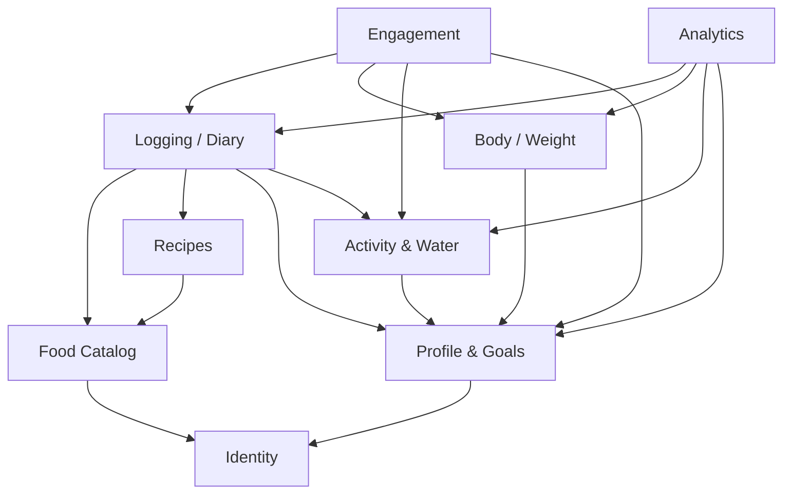

# Domain Boundaries (Bounded Contexts)

> Owner: Product Architecture. Ergänzt `docs/ARCHITECTURE.md §3–4`. Legt fest, welcher Kontext welche Tabellen **schreibt**,
> welche Services er anbietet und in welche Richtung Abhängigkeiten erlaubt sind. Ziel: keine Zyklen, klare
> Ownership, jeder Kontext einzeln testbar.

## 1. Kontexte im Überblick

| Kontext | Frage, die er beantwortet | Schreibt (Tabellen) | Code (Domain / Services) | Module |
|---|---|---|---|---|
| **Identity** | Wer ist der Nutzer? | `user`, `session`, `account`, `verification` | `src/server/auth/**`, `services/account/**` | Auth |
| **Profile & Goals** | Wer ist der Nutzer körperlich, was will er, welches Ziel gilt an Tag X? | `user_profiles`, `goal_profiles` | `domain/calories/**`, `domain/macros/**`, `services/{calories,goals,onboarding}/**` | Calorie Engine, Macro Engine, Onboarding, Settings |
| **Food Catalog** | Welche Lebensmittel gibt es, mit welchen Nährwerten und Portionen? | `foods` (source usda/off/curated/user), `food_brands`, `food_servings`, `favorite_foods`, `food_usage`, `external_lookup_cache` | `domain/food/**`, `server/food/**`, `services/{food-search,foods,user-foods,barcode}/**` | Food Data Import, Food Search, Custom Foods, Barcode |
| **Recipes** | Woraus besteht ein Gericht und was steckt in einer Portion? | `recipes`, `recipe_ingredients` (+ verknüpfte `foods`-Zeile über Food-Catalog-Service) | `domain/recipes/**`, `services/recipes/**` | Recipes |
| **Logging / Diary** | Was hat der Nutzer wann gegessen, und wie steht der Tag? | `meals`, `meal_entries`, `daily_nutrition` | `domain/nutrition/**`, `services/{logging,meals,nutrition}/**` | Meal Logging, Daily Nutrition Engine, Diary |
| **Body / Weight** | Wie entwickelt sich das Gewicht? | `weight_entries` | `domain/weight/**`, `services/weight/**` | Weight Tracking |
| **Activity & Water** | Wie viel Bewegung und Wasser? | `activities`, `water_entries` | `domain/activity/**`, `services/{activity,water}/**`, `server/integrations/**` | Activity & Water |
| **Engagement** | Was verdient Anerkennung, und was sagt Milo? | `user_achievements`, `mascot_interactions` | `domain/{gamification,mascot}/**`, `services/{gamification,mascot}/**` | Gamification, Mascot Engine, Mascot Design |
| **Analytics** | Welche Muster zeigen sich über Zeit? | – (nur lesend) | `domain/analytics/**`, `services/analytics/**` | Analytics |

## 2. Ownership-Details und Grenzfälle

**Identity** – liefert ausschließlich `userId` (über `getServiceContext()`). Kein anderer Kontext liest `session`
oder `account`. Konto löschen = `ON DELETE CASCADE` auf alle Nutzertabellen; das ist der einzige Kontext, der
Löschungen quer auslöst (durch die DB, nicht durch Aufrufe).

**Profile & Goals**
- Einzige Quelle für „welches Ziel gilt an Datum X“: `resolveGoalProfileForDate(ctx, date)` (Vertrag).
- `user_profiles.bmr_kcal/tdee_kcal` sind abgeleitete Werte, die nur die Calorie Engine schreibt.
- `start_weight_kg`/`target_weight_kg` gehören hierher; das **aktuelle** Gewicht gehört Body/Weight.
- `services/onboarding` schreibt `user_profiles` und legt über den Goals-Service das Default-Profil an. Die
  Standard-Mahlzeiten (Logging-Kontext) legt die Onboarding-**Server Action** über den Meals-Service an, falls
  sie nicht schon bei Signup entstanden sind – nicht der Onboarding-Service selbst (Richtung, siehe §3).

**Food Catalog**
- `foods` hat drei Schreiber mit getrennten Zeilen: Import/Provider (`source ∈ usda/off/curated`),
  User Foods (`source = user`), Recipes (`source = recipe` – nur über einen Catalog-Service
  `upsertRecipeFood()`, nie per direktem Insert aus `services/recipes`).
- `food_usage` wird bei jedem Log aktualisiert, aber **Logging schreibt die Tabelle nicht direkt**, sondern ruft
  einen Catalog-Service `recordFoodUsage(ctx, { foodId, servingId, quantity, mealId })`.
- Favoriten schreibt nur der Catalog (`toggleFavorite`); UI-Einstiege in 17 und 08 rufen denselben Service.
- Private Foods sind nur für `owner_user_id = ctx.userId` sichtbar – jede Suche/Detail-Abfrage filtert darauf.

**Recipes** – kennt Food Catalog (Zutaten sind `foods`). Nährwerte des Rezepts = Summe der Zutaten, normiert auf
100 g (Endgewicht oder Zutatensumme). Rezeptänderung aktualisiert die verknüpfte `foods`-Zeile, nie Einträge.

**Logging / Diary**
- `meal_entries` enthalten **Snapshots** (Name, Portion, Nährwerte). Nach dem Schreiben ist ein Eintrag unabhängig
  vom Catalog lesbar.
- `daily_nutrition` friert Ziele pro Tag ein; die Werte kommen aus `resolveGoalProfileForDate` (Profile & Goals).
- Tagessummen werden immer live aggregiert (`getDaySummary(ctx, date)`, Daily Nutrition Engine) – kein anderer Kontext
  berechnet eigene Summen aus `meal_entries`.

**Body / Weight** – Trend und Prognose sind reine Domain-Funktionen. Liest `target_weight_kg` aus Profile & Goals.

**Activity & Water** – liest `water_goal_ml`, `step_goal`, `add_activity_calories` aus Profile & Goals. Liefert
`getActivitySummary(ctx, date)` inkl. verbrannter kcal; ob diese aufs Budget angerechnet werden, entscheidet die
Daily Engine (Logging/Diary) anhand des Profil-Flags.

**Engagement**
- Serien werden aus `meal_entries` **berechnet** (über `getLoggedDates(ctx, range)` aus Logging), nicht gespeichert.
- Achievements werden nach Mutationen ausgewertet (`evaluateAchievements(ctx)`), idempotent (PK `user_id + key`).
- Milo-Regeln (`domain/mascot`) sind reine Funktionen: Eingabe = Snapshot des Tages (Summary, Ziele, Uhrzeit,
  Serie, letzte Interaktionen), Ausgabe = eine Nachricht oder `null`. `mascot_interactions` protokolliert
  `shown` / `dismissed` / `action_taken`.

**Analytics** – schreibt nichts. Liest über die öffentlichen Services von Logging (Tagessummen und eingefrorene
Tagesziele aus `daily_nutrition` je Zeitraum), Profile & Goals (aktuelles Ziel), Body (Trend), Activity. Eigene SQL-Aggregationen nur als
Read-Model innerhalb von `services/analytics`, niemals Schreibzugriffe.

## 3. Erlaubte Abhängigkeiten

Pfeil = „darf aufrufen / lesen“. Alles, was nicht eingezeichnet ist, ist **verboten**. Insbesondere:

| Verboten | Stattdessen |
|---|---|
| Catalog → Logging (z. B. „Anzahl Logs“ in der Suche lesen) | `food_usage` ist Catalog-Eigentum und wird über `recordFoodUsage` befüllt |
| Logging → Engagement (Achievement direkt nach dem Loggen auslösen) | Server Action orchestriert: `addMealEntry()` → `evaluateAchievements()` |
| Irgendein Kontext → Analytics | Analytics ist Blatt; Dashboard nutzt Logging/Body-Services direkt |
| Profile & Goals → Logging | Zieländerung aktualisiert `daily_nutrition` von heute/Zukunft über einen Logging-Service, aufgerufen von der Server Action |
| Direkter Tabellenzugriff auf fremde Tabellen im Service | Öffentliche Service-Funktion des Owner-Kontexts aufrufen |

## 4. Regeln für Querschnitts-Abläufe

1. **Orchestrierung in Server Actions** (`app/**/actions.ts`), nicht in Services. Beispiel „Food loggen“:
   `addMealEntry()` (Logging) → `recordFoodUsage()` (Catalog) → `evaluateAchievements()` (Engagement) →
   `revalidatePath('/today'); revalidatePath('/diary/[date]')`. Schlägt ein nachgelagerter Schritt fehl, bleibt der
   Eintrag gespeichert (Achievements holen sich beim nächsten Mal nach).
2. **Lesen quer ist erlaubt entlang der Pfeile**, Schreiben quer nur über die Service-API des Owners.
3. **Domain-Code ist kontextrein:** `src/domain/<kontext>/**` importiert nur `src/domain/nutrition/types.ts`
   (gemeinsame Werttypen) und den eigenen Kontext.
4. **Transaktionen** bleiben innerhalb eines Kontexts. Kontextübergreifende Konsistenz ist „eventual“ und
   idempotent (z. B. Achievements, `food_usage`).
5. **IDs statt Objekte:** Kontexte referenzieren sich über IDs (`foodId`, `goalProfileId`), nie über geteilte
   mutable Objekte.

## 5. Öffentliche Service-Schnittstellen (Minimum, Signaturen legen die Owner fest)

| Kontext | Funktion | Genutzt von |
|---|---|---|
| Profile & Goals | `resolveGoalProfileForDate(ctx, date)` | Logging, Analytics, Engagement |
| Profile & Goals | `getProfile(ctx)` | alle |
| Food Catalog | `searchFoods(ctx, query)`, `getFoodDetails(ctx, id)`, `lookupBarcode(ctx, ean)` | Logging-UI, Recipes |
| Food Catalog | `recordFoodUsage(ctx, …)`, `toggleFavorite(ctx, foodId)`, `upsertRecipeFood(ctx, …)` | Logging, Recipes |
| Logging / Diary | `getDaySummary(ctx, date)`, `getLoggedDates(ctx, range)`, `getDailyTotals(ctx, range)` | Dashboard, Engagement, Analytics |
| Logging / Diary | `addMealEntry`, `updateMealEntry`, `deleteMealEntry`, `copyMeal`, `copyDay` | Logging-/Diary-UI |
| Body / Weight | `getWeightTrend(ctx, range)`, `upsertWeight(ctx, date, kg)` | Dashboard, Analytics, Engagement |
| Activity & Water | `getActivitySummary(ctx, date)`, `addWater(ctx, date, ml)` | Dashboard, Logging (Budget) |
| Engagement | `getStreak(ctx)`, `evaluateAchievements(ctx)`, `getMascotMessage(ctx, screen)` | Dashboard, Actions |
